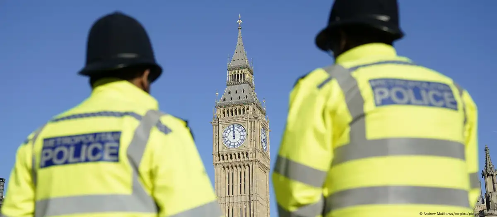

# UK-Policing-Disparities

###### Image Source: Andrew Matthews/empics/picture alliance

## Summary
Examining Ethnic Disparities in Policing Practices in the United Kingdom explores the complex interactions between law enforcement and diverse ethnic communities. Using the 2021 stop-and-search police dataset alongside census data, the study meticulously analyzes policing practices across different ethnic groups. Findings reveal stark disparities in the frequency and outcomes of stop-and-search incidents, with Black and Other ethnicities disproportionately targeted compared to White, Mixed, and Asian groups. This discrepancy underscores systemic biases and implicit associations that contribute to unequal treatment within law enforcement. Additionally, the study highlights significant underrepresentation of minority ethnicities within police forces, amplifying perceptions of institutional bias and hindering effective community engagement. Recommendations emphasize the urgent need for reforms to enhance transparency, accountability, and cultural sensitivity within policing strategies. Proposed measures include diversifying police recruitment, implementing rigorous training on implicit bias, and adopting procedural justice principles in stop-and-search policies. By fostering equitable and inclusive policing practices, policymakers can mitigate disparities, rebuild trust, and foster social cohesion in a multicultural society. Addressing these challenges is crucial for promoting fairness and ensuring that all individuals, regardless of ethnicity, receive equitable treatment and respect under the law.

## Technical Skills and Tools

| Skill                   | Details                                          |
|-------------------------|--------------------------------------------------|
| Geospatial Mapping      | Static and Interactive Mapping                   |
| Data Visualization      | GGPLOT (Maps, Bar Graphs, Pie Charts, Line Graphs)|
| Database Management     | SQL Queries in R                                 |

## Data Sources
1. Stop and Search Data collection(2021), Home Office UK
2. Census(2021), Office for National Statistics UK
3. Police Workforce, England and Wales (2021) - Home Office UK and Office for National Statistics UK
4. Annual Population Survey(2021), Office for National Statistics UK
5. Crime Survey for England and Wales (2021)
